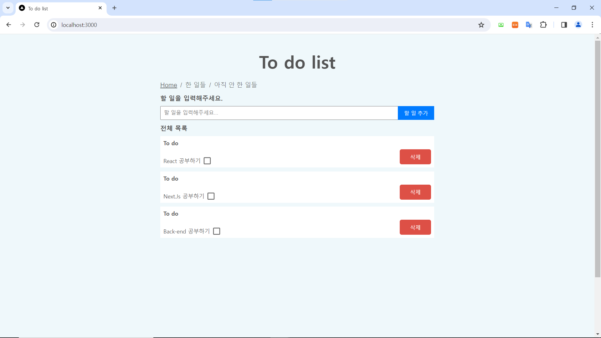
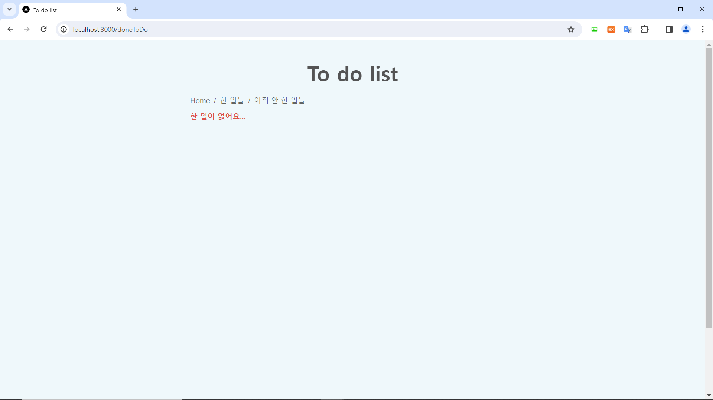
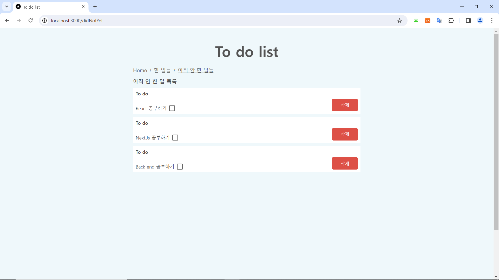

## Next.Js 13 To-Do-List (Atomic Design Pattern)
`
$ npm i
`

`
$ npm run dev `
(localhost:3000에서 실행)

`$ npx json-server --watch db.json --port 8080` 
(서버 열기: 8080번 포트)

Next.Js 13 버전과 Atomic 디자인 패턴을 연습하기 위한 To-Do-List

## 초기 화면 (Home)

## 한 일들

## 아직 안 한 일들

## Tech Stack
1. Next.Js 13
2. Tanstack/React-query
3. Typescript
4. Axios

